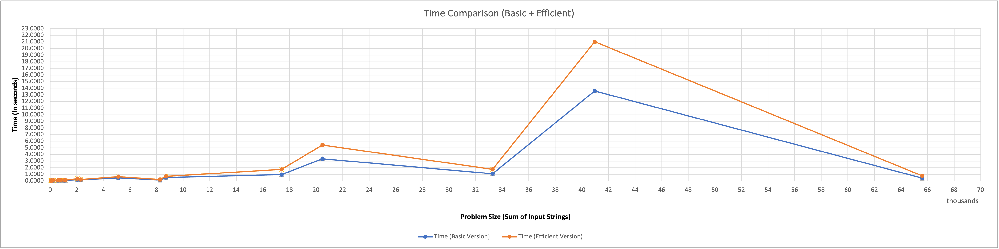
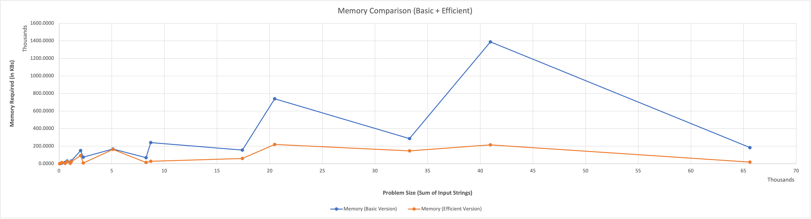
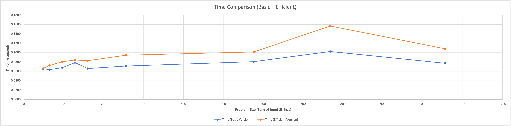
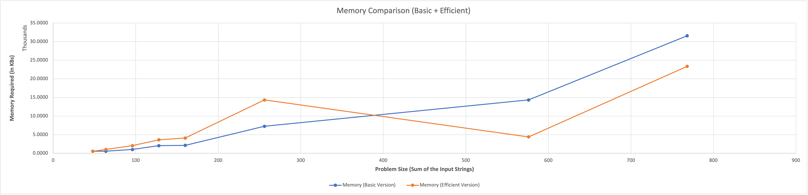

# CSCI570-FinalProject

Click [here](SequenceAlignmentMaven/src/main/resources/project-description.pdf) for project description

# Prerequisites

Requires Java 16 installed on the local machine as the code written uses some of the functionalities provided by Java 16

Please run the command - ```java --version``` or ```java -version``` to check the version currently installed on your
machine You should get the output like this

```
java 16.0.2 2021-07-20 
Java(TM) SE Runtime Environment (build 16.0.2+7-67)
Java HotSpot(TM) 64-Bit Server VM (build 16.0.2+7-67, mixed mode, sharing)

```

# Basic Version

## Explanation

We compute the optimal alignment between two strings X and Y of lengths m and n by building up the two-dimensional
m-by-n array which represents the subproblems to be solved. DP(x, y), which turns out to be equivalent to constructing a
graph G(XY) with (m x n) nodes laid out in a grid and look for the cheapest path between opposite corners.

## Complexity Analysis

### Time Complexity

O(mn), where m = length of input string 1, n = length of input string 2. This is because it takes constant time to
determine the value in each of the (m x n) cells of the array DP.

### Space Complexity

O(mn), where m = length of input string 1, n = length of input string 2. This is due to the fact that it is dominated by
the cost of storing the array (or the graph G(XY))

# Optimized Version

## Explanation

In memory efficient solution, we bring the space requirement down to linear while reducing the running time by at most
an additional constant factor.

## Observation

### Time

The efficient version always takes time that is greater than or equal to time taken by the basic version due to the fact
that one can optimize either time or space, and in this case, space is optimized at the expense of time.

### Memory

For small problem sizes, the memory required for the efficient version of the sequence alignment is greater than or
equal to the basic version. But the space optimization is clearly visible when the problem size increases. In the graph,
we can clearly see an inflection point when the efficient version outperforms the basic version in terms of memory.

## Background

The crucial changes in the basic algorithm:

- Forward formulation: As observed in the basic version, to fill in an entry of the array A, the recurrence only needs
  information from the current column of A and the previous column of A. Thus we will “collapse” the array A to an m × 2
  array B, where m = length of the input string 1. The array entry B[i, 1] holds the value of OPT(i, n) for i = 0, 1, .
  . . , m.
- Backward Formulation: We find f (i.e. the shortest path from (0, 0) to (i, j)) and g (shortest path from (i, j) to (m,
  n) in G(XY)) in reverse order respectively.
- Now combining the forward and backward formulation gives us the the length of the shortest corner-to-corner path in G(
  XY) that passes through (i, j) i.e. f(i, j) + g(i, j). The next step is to find a number k in {0,...,n}, and q: an
  index that minimizes the quantity f(q, k) + g(q, k). Then there is a corner-to-corner path of minimum length that
  passes through the node (q, k).
- Last step is to divide G(XY) along its center column and compute the value of f(i, n/2) and g(i, n/2) for each value
  of i, using the space-efficient algorithm twice for each section. We can then determine the minimum value of f(i, n/2)
    + g(i, n/2), and conclude that there is a shortest corner-to-corner path passing through the node (i, n/2). Given
      this, we can search for the shortest path recursively in the portion of G(XY) between (0, 0) and (i, n/2) and in
      the portion between (i, n/2) and (m, n). In running the algorithm, we maintain a globally accessible list P which
      will hold nodes on the shortest corner-to-corner path as they are discovered.

## Complexity Analysis

### Time Complexity

O(mn), where m = length of input string 1, n = length of input string 2 This is because it takes constant time to
determine the value in each of the (m x n) cells of the array DP.

### Space Complexity

O(m + n), where m = length of input string 1, n = length of input string 2 This is bevause we apply recursive calls
sequentially and reuse the working space from one call to the next. Since we only work on one recursive call at a time,
the total space usage is O(m + n)

## Graphical Visualization

|  |
| :--------------------------------------------------: |
|   <b>Time Plot (in seconds)</b>   |

|  |
|:----------------------------------------------------------:|
|                <b>Memory Plot (in KBs)</b>                 |

For inputs smaller than size 1000 (sum of the length of input strings), visualizations are as follows

|  |
|:-------------------------------------------------------------:|
|     <b>Time Plot for small problem sizes (in seconds)</b>     |

|  |
|:----------------------------------------------------------------:|
|       <b>Memory Plot for small problem sizes (in KBs)</b>        |

# Submissions

## Programs

- Basic_1111417799_3695883753.java
- Efficient_1111417799_3695883753.java
- StringGeneratorHelper.java

## Scripts

- 1111417799_3695883753_basic.sh
- 1111417799_3695883753_efficient.sh

## Plots

- CPUPlot.png - Plot that displays the time pattern across all problem sizes
- CPUPlot-small.png - Plot that displays the time pattern across small problem sizes
- MemoryPlot.png - Plot that displays the memory pattern across all problem sizes
- MemoryPlot-small.png - Plot that displayss the memory pattern across small problem sizes

## How to Execute

Unzip the folder named "1111417799_3695883753.zip" and navigate to the location where the shell scripts are present.
Open the terminal here and run the following commands:

1. ```sh 1111417799_3695883753_basic.sh```
2. ```sh 1111417799_3695883753_efficient.sh```

Running each of these commands will generate an output.txt file (it will overwrite the contents of the file if it
already exists)

## Sample Output
For input.txt content as follows - 

```
ACGT
2
1
4
8
11
13
TGAC
1
4
3
10
11
22
47
21
38
```

Basic Version - 
```
__________________________________________________ _________G________T_TG_____AC_G________T_T________
TGTGTGTGATGTTGTGTGTGATTGTGTGTGATGTTGTGTTGTGTGTGATG GTGTGATGTGACACCACATGTGACACCACTGACACCACATGTGACACCAC
53760.0
0.175819
6408.0859375
```

Efficient Version -
```
________A_________________________________________ _________________________________________T________
TGTGTGTGATGTTGTGTGTGATTGTGTGTGATGTTGTGTTGTGTGTGATG GTGTGATGTGACACCACATGTGACACCACTGACACCACATGTGACACCAC
53760.0
0.210404
456.5703125
```

- 1st Line: Alignment of String A
- 2nd Line: Alignment of String B
- 3rd Line: Alignment Score
- 4th Line: Time required for the code to complete (in seconds)
- 5th Line: Memory required for the entire code (in KBs)

# Contribution towards the project:

1. String Generator:            1111417799
2. Basic version :                3695883753
3. Memory efficient version :    1111417799
4. Test cases generation :        3695883753
5. Plotting :                    1111417799
6. Documentation:                3695883753

----------------------  

# Sequence Alignment (Extended)

Refer [SequenceAlignmentMaven](SequenceAlignmentMaven)

This is an extension to the code written in [1111417799_3695883753](1111417799_3695883753) module. The following options
can be used to extend the modularity of the code -

| Flag                       | Description                                                                                                           |
|----------------------------|-----------------------------------------------------------------------------------------------------------------------|
| ```isCustomEnabled```            | enable this to toggle pass a custom input rather than reading the input from the file, default = false                |
| ```isSpaceOptimizationEnabled``` | enable this to execute the code with space optimization enabled, default = false                                      |
| ```isPrinting2DMatrixEnabled```  | enable this to print the 2D numerical matrix that is generated as a part of the DP table calculation, default = false |
| ```isDivideAndConquerEnabled```  | enable this to perform sequence alignment using Divide and Conquer + Dynamic Programming approach, default = false    |
| ```isLoggingEnabled```           | enable this to display stepwise logs of the application, default = false                                              |
| ```isWriteOutputToFile```        | enable this to write the output to the file 'output.txt', default = false                                             |

## Limitations

- Divide and Conquer + DP can only run with Space Optimized enabled. Please set -isSpaceOptimizationEnabled = true
  or ```-isDivideAndConquerEnabled = false```
- 2D DP Matrix cannot be printed if Space Optimization is enabled. Please set ```-isPrinting2DMatrixEnabled = false```
- Custom input executions cannot be written to the file. Please set ```-isWriteOutputToFile = false```

## Unit Tests

The unit tests are written in a manner that inputs will be randomly generated and will be tested for 20 cases.

### Validation

Calculation of the Needleman Wunsch score for both the basic version and the efficient version. If both of the scores
are same, then the test is assumed to have passed.

This is a maven based module and the entire code can be executed using the following command -

```
 java -cp <jar-name-here>.jar org.algo.SequenceAlignmentMaven -basePath "<base-path-to-input-file-here>" -filename <input-file-name-here> -firstString <first-string-here> -secondString <second-string-here> -isCustomEnabled <true/false> -isSpaceOptimizationEnabled <true/false> -isPrinting2DMatrixEnabled <true/false> -isDivideAndConquerEnabled <true/false> -isLoggingEnabled <true/false>
```

Please adhere to the limitations while keeping setting the true/false options 